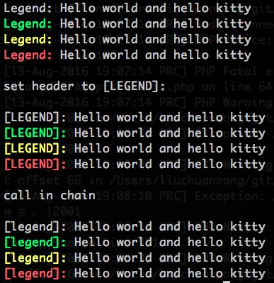

# ColorPrinter
Print message to terminal with <span style="color:green;">colored</span> header

## usage
- Snippets

```
python

from ColorPrinter import ColorPrinter

printer = ColorPrinter('Legend:')
printer.log('Hello world', 'and', 'hello kitty')
printer.info('Hello world', 'and', 'hello kitty')
printer.warn('Hello world', 'and', 'hello kitty')
printer.error('Hello world', 'and', 'hello kitty')
# <span style="color:red;">Hello world<span>
print

printer.setHeader('[LEGEND]:')
printer.log('Hello world', 'and', 'hello kitty')
printer.info('Hello world', 'and', 'hello kitty')
printer.warn('Hello world', 'and', 'hello kitty')
printer.error('Hello world', 'and', 'hello kitty')

print

printer.setHeader('[legend]:')
printer.log('Hello world', 'and', 'hello kitty') \
    .info('Hello world', 'and', 'hello kitty') \
    .warn('Hello world', 'and', 'hello kitty') \
    .error('Hello world', 'and', 'hello kitty')

```

- Results



